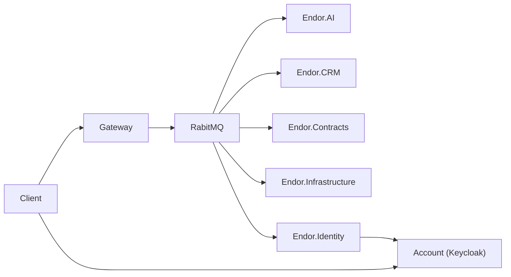

# AI

## 1. Bestanden

De bestanden bevat een development omgeving in Docker.
Dit bevat Python met LangChain.

## 2. LLama en DeepSeek

Allebei zijn allebei offline open-source large language models.
LLama is gemaakt door Meta, wat dus facebook is.

DeepSeek is gemaakt door een Chinees bedrijf met ook de naam DeepSeek.
Wanneer je deze via bijvoorbeeld Ollama gebruikt, is hij volledig offline.
Echter, via veel andere manieren niet.
Dit kan dus een groot privacy probleem zijn.
Maar dit is het zelfde met Llama.

Met behulp van Ollama kunnen wij deze models eenvoudig in Docker gebruiken.

## 3. Hardware acceleration

1. [NVIDIA Container Toolkit](https://docs.nvidia.com/datacenter/cloud-native/container-toolkit/latest/install-guide.html#installation)

## 6. Endor architectuur

