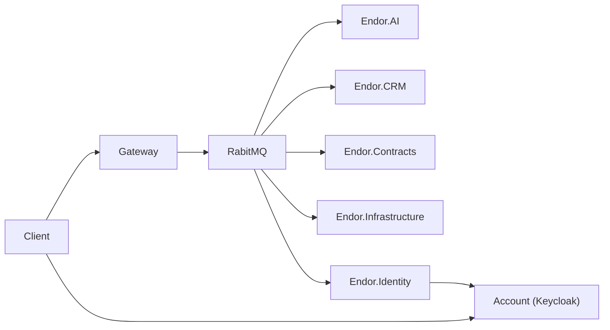

# AI

Welkom allemaal.

## 1. Bestanden

De bestanden bevat een development omgeving in Docker.
Dit bevat Python met LangChain.

Daarnaast bevat het ook deze presentatie.

## 2. Endor en AI

Maar waarom praten wij over AI?
Zoals sommige van jullie misschien al weten werken wij aan Endor.
Dit is een applicatie om voor nu alleen contracten te beheren.
Wat wij willen toevoegen is een chatbot waaraan je vragen kan stellen.
Denk hierbij aan vragen zoals
"welke contracten lopen er deze week af?" of "Laat mij de contracten voor Robin zien".
Uiteindelijk zijn vragen zoals "Welke contracten volgen de wet?" misschien ook wel mogelijk.

Endor is een applicatie die gebruik maakt van micro services en is volledig opgezet in Dotnet.
Hierdoor is er een AI service in Dotnet, maar dit kan ook eenvoudig Python of iets anders zijn.

## 3. Endor architectuur

Dan even heel kort de architectuur van Endor.
Het client stuurt aanvragen naar de gateway.
Deze zet vervolgens messages op de event broker.

Voor de chatbot handelt de AI service de messages af.

## 3. LLama en DeepSeek

Er zijn heel veel modellen beschikbaar tegenwoordig zoals Gemini of CoPilot.
Deze modellen zijn alleen allemaal via een API te gebruiken en zijn dus niet offline.
Hierdoor zijn deze super krachtig en kunnen ze veel.
Alleen heeft het wel een grootte privacy nadeel.

Daarom gebruiken wij LLama.
Deze is, net zoals DeepSeek, een volledig offline model en open-source.
LLama is gemaakt door Meta, wat dus facebook is.
DeepSeek is gemaakt door een Chinees bedrijf met ook de naam DeepSeek.
Wanneer je deze via bijvoorbeeld Ollama gebruikt, is hij volledig offline.
Alleen via veel andere manieren niet.
Dit kan dus ook een groot privacy probleem zijn.
Maar dit is het zelfde met Llama en de andere modellen.

Met behulp van Ollama kunnen wij deze models eenvoudig in Docker gebruiken.

Voor Endor heb ik nu alleen nog maar LLama gebruikt.

## 4. Ollama en Docker

Hoe gebruiken wij vervolgens de offline models?
Dit kan het makkelijkste via Docker.
Met deze `docker-compose` kunnen wij Ollama opzetten.
Hierbij gebruiken wij een port en een volume.
De volume zorgt er voor dat wij het model niet elke keer opnieuw hoeven te downloaden.

Met een `docker compose up` voeren wij de service uit.
Hierna kunnen wij met een execute het model runnen waarna wij een chat krijgen.

Dit kan je eventueel op je eigen PC uitvoeren.
Het Lamma 3.2 model is iets van 2 gig waardoor hij niet zo groot it.
Hij is ook via de Dagobah server te gebruiken.

## 5. Hardware acceleration

De modellen draaien het beste op de grafische kaart met hardware acceleration.
Hiervoor moeten wij eerst de NVidia container toolkit downloade.

1. [NVIDIA Container Toolkit](https://docs.nvidia.com/datacenter/cloud-native/container-toolkit/latest/install-guide.html#installation)

Hierna moeten wij in de docker compose de GPU koppelen.
Nu kan Ollama de Nvidia kaart gebruiken.

## 6. Terminology

Dan vervolgens wat terminology voor chatbots.

Met een system prompt geef je aan wat een chatbot is, wat het mag doen, wat het niet mag doen, etc.
Hierin kan je bijvoorbeeld aangeven dat de chatbot alleen maar markdown mag gebruiken.
Dat hij geen data moet hallucineren, etc.

Embeddings is een numerieke representatie van tekst.
De tekst wordt door een model omgezet is nummers.
Hierop kan je vervolgens een correlatie algoritme op los laten.
Zo kan je de tekst vinden die het meeste correlatie tot een bepaalde prompt heeft.
Dit gebruikt Google ook voor zijn zoek resultaten om zo de beste resultaten te geven.

Retrieval-augmented Generation combineert vervolgens deze embeddings.
Hiermee kan je documenten inladen, omzetten in embeddings en vervolgens een correlatie search op uitvoeren.
Hierna krijg je documenten terug die je in je system prompt kan gebruiken.

Fine-tuning is een manier om een model op een specifieke taak te trainen.
Voor Endor kunnen wij het model trainen zodat hij alleen antwoorden op contracten terug geeft
en bijvoorbeeld geen kennis van JavaScript heeft.
Dit is een process wat dagen lang op de GPU uitgevoerd moet worden.
Hierdoor heb ik hier nog niet naar gekeken.

## 7. Retrieval-augmented Generation (RAG)

Een bruikbare chatbot heeft ook toegang tot data die hij kan gebruiken om je verder te helpen.
Dit is vaak actuele data, zoals de contracten voor Endor.
Deze contracten kunnen constant veranderen.
Hierdoor kunnen wij het model niet fine-tunen doordat de contracten misschien al veranderd zijn
voordat het model getrained is.
Hiervoor kan Retrieval-augmented Generation, of te wel rag, gebruikt worden.
Dit is een soort van kortetermijngeheugen voor een llm.
We zetten documenten om in embeddings waarop wij vervolgens kunnen zoeken.
Hierop voeren wij een correlatie algoritme op los om de documenten op te halen die het
beste bij de prompt passen.

Deze embeddings kunnen wij in een vector database opslaan.
Dit zorgt er voor dat wij heel snel en actueel de documenten kunnen ophalen.
Dus wanneer bijvoorbeeld een contract aanpast kan de database meteen bijgewerkt worden.
Hiermee heb je dus altijd actuele data.
Om deze data op te slaan kan je bijvoorbeeld Postgres met een plugin of Redis gebruiken.

## 9. LangChain

Er zijn veel verschillende frameworks en libraries om models te gebruiken.
Een daarvan is LangChain voor Python.
Het is een framework waarmee je bijvoorbeeld een chatbot op kan zetten.
Dit is een uitgebreid framework met packages voor bijvoorbeeld Ollama, Redis en Google searches.

## 9. Vraagstukken

Ik ben bezig met het verbeteren van de chatbot.
De system prompt moet constant aangepast worden om een beter resultaat te krijgen.

Ook wil ik graag een reasoning loop toevoegen.
De vector database zoekt niet op de eind datum.
Hiervoor moet een query als "Welke contracten lopen af?" omgezet worden naar een bruikbare vraag.

## 10. Speeltijd

Nu hebben jullie een beetje een idee hoe wij AI gebruiken en willen gebruiken in Endor.
Nu hebben wij tijd om hierover te praten en eventueel een beetje met LangChain te spelen.
Hiervoor heb ik eventueel een development omgeving omgezet via Docker waarmee je python kan uitvoeren.

